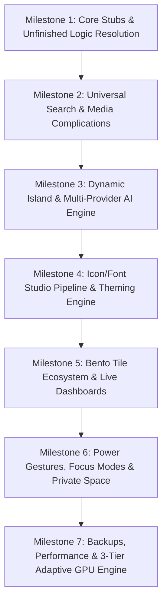

# Pulse Launcher — Phased Execution Strategy & Unlazy Acceptance Gates

This document establishes the **execution roadmap**, **dependency architecture**, and **formal acceptance gates** to drive the implementation of all audited stubs, table-stakes features, differentiators, and architectural upgrades across Pulse Launcher.

---

## 1. Milestone Dependency Graph

---

## 2. Phased Execution Roadmap

### Milestone 1: Core Stubs & Unfinished Logic Resolution
- **Goal:** Transform all current stub pages into fully functional, data-bound components and fix legacy API deprecations.
- **Key Deliverables:**
  1. **Feed Page (Slide 1):** Add live Weather card integration (Open-Meteo / Android Weather provider) and Next Calendar Event card (`CalendarContract`).
  2. **Bento Grid (Slide 2):** Connect `TileCell` to dynamic interactive renderers (Live Clock, Weather, Media Controller, and AI Assistant entry points).
  3. **Control Center:** Fix Wi-Fi toggle using `Settings.Panel.ACTION_WIFI` (Android 10+) with legacy fallback; add Flashlight (`CameraManager`), Auto-Rotate, and Airplane mode toggles.
  4. **App List (Slide 3):** Implement custom wave sensitivity slider and configurable tactile vibration curves in `AlphabetRail`.

### Milestone 2: Universal Search & Media Complications
- **Goal:** Expand `SearchViewModel` from a simple app filter into an offline/online universal search powerhouse.
- **Key Deliverables:**
  1. **Contacts Search:** Asynchronous querying via `ContactsContract.CommonDataKinds.Phone`.
  2. **Local Media & Files Search:** Fast querying via `MediaStore.Files`.
  3. **Micro-Calculations & Conversions:** Offline mathematical expression evaluator and currency/unit conversions directly in query box.
  4. **Web Search Fallbacks & In-App Shortcuts:** Dynamic intents for Google, DuckDuckGo, Brave, and app deep shortcuts via `LauncherApps`.

### Milestone 3: Dynamic Island & Multi-Provider AI Engine
- **Goal:** Upgrade the Dynamic Island overlay into an interactive liquid surface with resilient multi-provider AI streaming.
- **Key Deliverables:**
  1. **Multi-Provider AI Client:** Implement adapters for **Anthropic (Claude 3.5/3.7/Opus)**, **OpenAI (GPT-4o)**, **Google Gemini**, **Groq**, and local **Ollama** endpoints.
  2. **Resilient Fallback Chain:** Automatic retry failover when primary provider hits rate limits (429) or network errors.
  3. **Island Complications:** Live active timer countdown, stopwatch ticking, phone call status with end-call action, and privacy dot indicators (Camera/Mic).
  4. **Encrypted KeyStore Persistence:** Store all API credentials securely in hardware-backed Android KeyStore + Jetpack DataStore.

### Milestone 4: Icon/Font Studio Pipeline & Theming Engine
- **Goal:** Complete the unified design studio pipeline with custom shader post-processing and fine-grained color controls.
- **Key Deliverables:**
  1. **Advanced Icon Shaders:** Implement `DUOTONE`, `HOLOGRAPHIC`, `FILM_GRAIN`, and `MATERIAL_YOU_THEMED` styles in `IconRenderer.kt`.
  2. **Per-App Icon & Shape Overrides:** Database-persisted icon pack and mask shape overrides per package name.
  3. **HCT Fine-Tuning Sliders:** Chroma, Tone, and Hue fine-tuning overrides for the wallpaper-extracted Material You palette.
  4. **Font Studio Typography Engine:** Dynamic Google Fonts downloader and custom TTF/OTF loader updating Compose theme typography tokens.

### Milestone 5: Bento Tile Ecosystem & Live Dashboards
- **Goal:** Deliver an expansive widget/tile ecosystem with 3D flip animations, resizing handles, and smart context.
- **Key Deliverables:**
  1. **Tile Resizing & Drag Handles:** Real-time magnetic snap-to-grid handles with haptic feedback ticks.
  2. **Tile 3D Flip Animations:** Double-tap or swipe to flip tiles between primary data and secondary details (e.g. Weather $\leftrightarrow$ 5-day forecast).
  3. **Specialized Tiles:** Clipboard history tile, Screen Time / Digital Wellbeing summary tile, and App Pair split-screen launcher tile.
  4. **Folder Dashboards:** Expanding folders into full-screen frosted glass canvases with aggregated notification badges.

### Milestone 6: Power Gestures, Focus Modes & Private Space
- **Goal:** Implement power-user customization, biometric app locking, and automated distraction-free environments.
- **Key Deliverables:**
  1. **Gesture Dispatcher:** Configurable double-tap to lock, 2-finger swipe, pinch-to-edit, and custom edge swipes.
  2. **Gesture App Launching:** Canvas overlay for drawing letters (e.g., draw 'M' to open Maps).
  3. **Scheduled Focus Modes:** Auto-hide distracting app categories during Work/Sleep hours using `pulse_focus_modes` schema.
  4. **Private Space Integration:** Android 15 `PrivateSpace` authentication and biometric lock on hidden apps.

### Milestone 7: Backups, Performance & 3-Tier Adaptive GPU Engine
- **Goal:** Ensure enterprise-grade stability, zero-jank 120Hz scrolling, and seamless data portability.
- **Key Deliverables:**
  1. **JSON Backup & Migration Engine:** Full export/import of all database entities, tile layouts, and preferences (plus Nova Launcher backup parser).
  2. **3-Tier Adaptive GPU Renderer:** Dynamic fallback from real-time AGSL blurs (Full) to static render effects (Reduced) or flat alpha colors (Minimal) based on battery and RAM pressure.
  3. **Perfetto Benchmarks & Spotless Quality Gate:** Zero recomposition loops, zero frame drops, and 100% Spotless lint pass.

---

## 3. Formal Unlazy Acceptance Gates (`GATES.md` update specification)

| Gate ID | Area | Acceptance Command / Check | Expected Output | Critical Evidence |
|---|---|---|---|---|
| **G5** | Unfinished Logic | `./gradlew testDebugUnitTest --tests "*Pulse*"` | `BUILD SUCCESSFUL` with all unit tests passing | Test execution report covering search, converters, and Island state machines |
| **G6** | Universal Search | `./gradlew testDebugUnitTest --tests "*SearchViewModelTest*"` | Querying apps, math expressions, and contacts returns structured `SearchResult` items | Mock `ContactsContract` and calculator unit tests pass |
| **G7** | AI Fallback Chain | `./gradlew testDebugUnitTest --tests "*AiProviderFallbackTest*"` | Simulating 429 on Anthropic/OpenAI triggers automatic Groq/Ollama fallback | SSE parser stream events collected without crash |
| **G8** | Icon Studio Pipeline | `./gradlew testDebugUnitTest --tests "*IconRendererTest*"` | `IconRenderer.render()` outputs non-null Bitmaps across all 7 shader styles | Canvas blend modes and mask clipping verify without memory leaks |
| **G9** | Formatting & Lint | `./gradlew spotlessCheck` | `BUILD SUCCESSFUL` | Zero KtLint / Google Java Format violations |
| **G10** | Full APK Compilation | `./gradlew assembleDebug --console=plain` | `BUILD SUCCESSFUL` | `build/outputs/apk/debug/app-debug.apk` compiled successfully |
