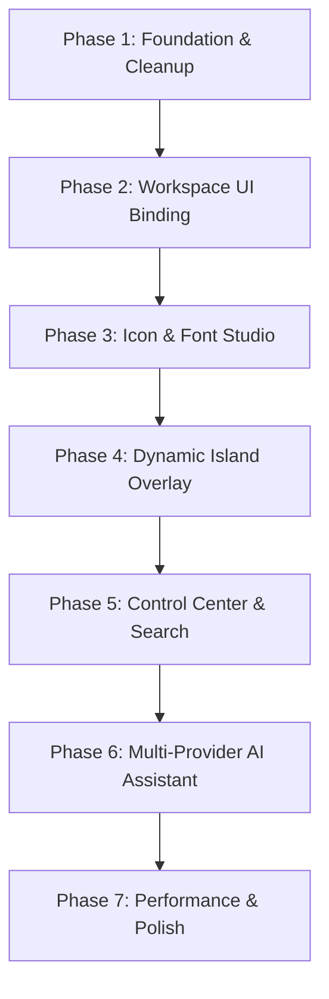

# Pulse Launcher — Comprehensive Implementation Plan

This document establishes the official technical specifications, structural gap analysis, and a structured, phased implementation roadmap for developing the complete suite of custom Pulse Launcher features on top of the Lawnchair 14/Launcher3 foundation.

---

## 1. Audited Gap Analysis

| Feature Area | Current Code State | What is Missing | Technical Dependency |
|--------------|--------------------|-----------------|----------------------|
| **3-Slide Workspace** | **Halfway Done**<br>- `PulseWorkspaceHost` attaches the Compose pager to `LawnchairLauncher`'s `dragLayer`. <br>- Pager structure and haptic tick on settle exist. | - Active bento-grid widgets and custom bento tile database mapping.<br>- Functional vertical list app binding with alphabetical index. | Jetpack Compose Pager, Room DB, Opto DataStore |
| **Dynamic Island Overlay** | **Missing**<br>- No service, states, or layouts exist. | - `TYPE_APPLICATION_OVERLAY` service.<br>- Hidden/Minimal/Compact/Expanded state machine.<br>- Active `MediaSessionManager` binding and timer tracking. | Android `WindowManager`, Foreground Service, `NotificationListenerService` |
| **Icon Studio** | **Missing**<br>- No processing pipeline exists. | - Room-backed configuration schema (`IconStudioConfig`).<br>- Dynamic `IconRenderer` class processing standard package drawables with filter matrices (Neon, Liquid Glass, Embossed). | Canvas BlendModes, ColorFilter Matrix, Room DB |
| **Font Studio** | **Missing** | - Font token configurations in MaterialTheme typography.<br>- Dynamic Google Fonts loading or locale font-family swapping. | Compose Typography, Google Fonts API, DataStore |
| **Control Center** | **Missing** | - Right-edge swipe detector overlay.<br>- Slide-down panels with system toggles (Wi-Fi, Bluetooth, slider controls for brightness/volume). | Android `Settings.System` writes, custom overlay |
| **Unified Search** | **Missing** | - Key-intercepting search bar overlays.<br>- Unified cursor querying system (Apps, Contacts, Files). | `ContactsContract`, `ContentResolver`, Retrofit SSE |
| **Digital Assistant** | **Missing** | - Retrofit EventSource chat completions client.<br>- On-device offline summarizer integration or remote API bindings. | OkHttp EventSource, Retrofit Serializer, Android Keystore |

---

## 2. Technical Research & Implementation Recipes

### A. Dynamic Island Foreground Overlay Service
The Dynamic Island must run as a persistent system overlay so that it displays over other apps, status bars, and system layouts.

1. **Service Registration:** Create a foreground service `app.lawnchair.pulse.island.IslandService : Service()`.
2. **WindowManager Registration:**
   ```kotlin
   val windowManager = getSystemService(WINDOW_SERVICE) as WindowManager
   val params = WindowManager.LayoutParams(
       WindowManager.LayoutParams.WRAP_CONTENT,
       WindowManager.LayoutParams.WRAP_CONTENT,
       WindowManager.LayoutParams.TYPE_APPLICATION_OVERLAY,
       WindowManager.LayoutParams.FLAG_NOT_FOCUSABLE or 
       WindowManager.LayoutParams.FLAG_LAYOUT_IN_SCREEN or
       WindowManager.LayoutParams.FLAG_LAYOUT_INSET_DECOR,
       PixelFormat.TRANSLUCENT
   ).apply {
       gravity = Gravity.TOP or Gravity.CENTER_HORIZONTAL
       y = 12 // Position below the camera punch-hole
   }
   ```
3. **Compose Mount:** Create a custom `ComposeView(this)` and inject it via `windowManager.addView(composeView, params)`. Use `ViewCompositionStrategy.DisposeOnViewTreeLifecycleDestroyed` for clean lifecycle disposal.
4. **Active Media Session Hooks:**
   Register a listener using Android's `MediaSessionManager`:
   ```kotlin
   val mediaSessionManager = getSystemService(Context.MEDIA_SESSION_SERVICE) as MediaSessionManager
   mediaSessionManager.addOnActiveSessionsChangedListener({ controllers ->
       val activeController = controllers?.firstOrNull()
       // Update island state with active playback title, artist, and album art
   }, ComponentName(this, PulseNotificationListener::class.java))
   ```

### B. Icon Studio Color-Filter Rendering Pipeline
To apply visual post-processing (such as iOS 27 Liquid Glass, Neon, or Embossed styles) on any system app icon:

1. **Extract Base Icon:** Query package drawable: `packageManager.getApplicationIcon(packageName)`.
2. **Extract Palette Tones:** Use `Palette.from(bitmap).generate()` to isolate dominant, vibrant, and dark muted colors.
3. **Canvas Drawing Pipeline:**
   Create a target Bitmap and apply custom Canvas draw steps:
   ```kotlin
   val output = Bitmap.createBitmap(baseWidth, baseHeight, Bitmap.Config.ARGB_8888)
   val canvas = Canvas(output)
   val paint = Paint(Paint.ANTI_ALIAS_FLAG)
   
   // 1. Draw custom background shape mask (squircle, circle, leaf)
   canvas.drawPath(squirclePath, paint)
   
   // 2. Blend original app icon with destination-in
   paint.blendMode = BlendMode.DST_IN
   canvas.drawBitmap(originalIcon, 0f, 0f, paint)
   
   // 3. Apply Liquid Glass Specular highlight & Dark edge (iOS 27 specs)
   paint.blendMode = BlendMode.SRC_OVER
   paint.color = Color.WHITE // Specular top edge
   canvas.drawPath(topEdgeRimPath, paint)
   
   paint.color = Color.BLACK // Dark bottom rim
   paint.alpha = 38 // 15% opacity dark border
   canvas.drawPath(bottomRimEdgePath, paint)
   ```
4. **Caching:** Store compiled drawables in a memory-bounded `LruCache<String, Drawable>` where the key is `"${packageName}_${configHash}"`.

### C. Bento-Grid Tile Dashboard
To replace the static `TileGridPage.kt` stub with a highly customized layout:

1. **Layout Matrix:** Implement a 4-column grid using `LazyVerticalGrid` in Compose.
2. **Room Database Schema:**
   ```kotlin
   @Entity(tableName = "pulse_tiles")
   data class TileConfig(
       @PrimaryKey val id: String,
       val tileType: String, // "APP", "MEDIA", "WEATHER", "ASSISTANT"
       val spanX: Int,       // 1, 2, or 4 cells
       val spanY: Int,
       val packageName: String?,
       val customLabel: String?
   )
   ```
3. **Reordering Physics:** Hook up `sh.calvin.reorderable` parameters to allow dragging and rearranging tile placements with physical overshoot springs.

### D. Custom Control Center Overlay
A translucent quick settings slide-down menu.

1. **Gesture Trigger:** Register a small invisible edge-swipe touch listener at the top-right corner of `LawnchairLauncher`'s layouts.
2. **Background Blur:**
   To apply a frosty glass background on Android 12+ (API 31+):
   ```kotlin
   val renderEffect = RenderEffect.createBlurEffect(25f, 25f, Shader.TileMode.CLAMP)
   view.setRenderEffect(renderEffect)
   ```
   For Compose backgrounds, incorporate standard blur layers or fallbacks for low-end (Android Go) environments.

### E. Multi-Provider AI SSE Streaming
The digital assistant requires low-latency, real-time typing indicators.

1. **SSE Network Adaptor:**
   Use OkHttp's `EventSource` library:
   ```kotlin
   val request = Request.Builder()
       .url("https://api.openai.com/v1/chat/completions")
       .addHeader("Authorization", "Bearer $apiKey")
       .post(requestBody)
       .build()
   
   val eventSource = EventSources.createFactory(okHttpClient)
       .newEventSource(request, object : EventSourceListener() {
           override fun onEvent(eventSource: EventSource, id: String?, type: String?, data: String) {
               // Parse data chunks and emit stream tokens to UI Flow
           }
       })
   ```

---

## 3. Step-by-Step Phased Implementation Roadmap



### Phase 1: Foundation & Cleanup (Milestone 1)
*   **Tasks:**
    1.  Purge unused Android localization translation assets (`res/values-*`) and fastlane configurations.
    2.  Set up the base `pulse` database schemas in a Room module, defining entities for `TileConfig` and `IconStudioConfig`.
*   **Acceptance Gate:** `./gradlew spotlessApply && ./gradlew assembleDebug` completes successfully; output package size drops substantially.

### Phase 2: Workspace UI Binding (Milestone 2)
*   **Tasks:**
    1.  Replace the `ListPage.kt` stub with a vertical list matching the Niagara-style vertical wave alphabet, scrolling smoothly with custom tactile vibrator ticks.
    2.  Build the 4-column Bento layout in `TileGridPage.kt` and hook it up to compile dynamic grid shapes.
*   **Acceptance Gate:** User can scroll horizontally between a functioning Feed page, interactive tile grid, and alphabetical vertical list.

### Phase 3: Icon & Font Studio (Milestone 3)
*   **Tasks:**
    1.  Create the `IconRenderer` canvas processing pipeline.
    2.  Implement the custom settings layout screen, allowing the user to select global shape overlays, shadows, and post-processing styles (such as the iOS 27 Liquid Glass spec).
    3.  Integrate the dynamic Google Fonts pairing selector into `LawnchairLauncher`'s theme hooks.
*   **Acceptance Gate:** Modifying shapes or themes in settings immediately updates all launcher layouts and app icons.

### Phase 4: Dynamic Island Overlay (Milestone 4)
*   **Tasks:**
    1.  Develop the `IslandService` foreground overlay, requesting overlay window permissions.
    2.  Build the layout states (Hidden, Compact, Minimal, Expanded).
    3.  Wire up the active `MediaSessionManager` and volume tracker events to trigger island morph states.
*   **Acceptance Gate:** Playing a song in Spotify draws a compact capsule pill at the top of the screen displaying album art and a dynamic waveforms visualizer, expanding into custom controls upon a long-press.

### Phase 5: Control Center & Search Overlay (Milestone 5)
*   **Tasks:**
    1.  Develop the top-right corner edge-swipe gesture detector to slide down the Control Center.
    2.  Hook up toggle sliders for brightness, volume, DND state, and Wi-Fi flags.
    3.  Implement the unified search bar popover, querying Contacts, Apps, and Local Files.
*   **Acceptance Gate:** Swiping down from top-right drops a frosted-glass panel containing sliders and toggles, updating system hardware settings instantly.

### Phase 6: Multi-Provider AI Assistant (Milestone 6)
*   **Tasks:**
    1.  Set up OkHttp SSE connection hooks.
    2.  Implement provider-specific adapters for OpenAI, Gemini, Anthropic, Ollama, DeepSeek, and Groq.
    3.  Incorporate the Chat UI bubble inside the expanded state of the Dynamic Island.
    4.  Add hardware-backed Android KeyStore encryption for API credentials.
*   **Acceptance Gate:** Typing a query inside the search box or expanded island streams replies in real time with typing animations. Keys are stored securely.

### Phase 7: Performance Optimization & Polish (Milestone 7)
*   **Tasks:**
    1.  Run deep Perfetto traces to profile recomposition frequencies in the bento grid.
    2.  Optimize low-end (Android Go) behavior by falling back to flat colors instead of rendering expensive dynamic blurs.
    3.  Create instrumented Compose UI unit and smoke tests.
*   **Acceptance Gate:** Launcher passes all spotless lint gates, executes without frame drops at 120Hz on modern high-refresh LTPO panels, and falls back gracefully on 2GB RAM layouts.
